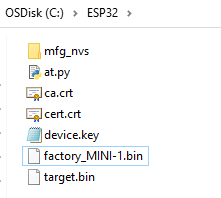
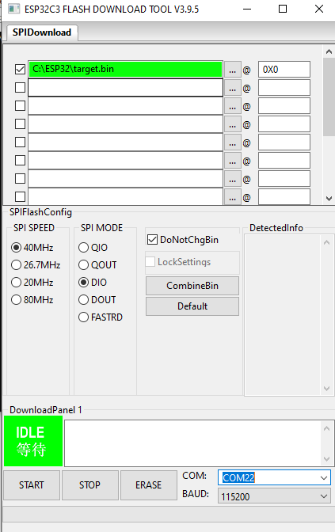

## Introduction

- This document demonstrates the steps of setting up the STM32 B-U585I-IOT02A board with ESP32-C3 modoule
for connecting to Avnet's IoTConnect Platform.

## Hardware Setup

* Connect STM32 B-U585I-IOT02A board to ESP32-C3 moudule via the Arduino connector and then to your PC via a Micro USB cable.
* Once the board boots up, a new USB devices will be available. Connect a terminal program (like TeraTerm) to one of the two COM ports
which is named "USB Serial". Use defaults for 115200 baud: 8 bits, 1 stop bit, no flow control or parity. 
Firmware logs will be available on that COM port. 

**Note**: For EBV ESP32 shield, the two switches are required to be at "EXT" and "SLAVE" positions in order to work with a host board.


## Software Preparation
- Follow the instructions to create STM32 projects in this GitHub [repository](https://github.com/stm32-hotspot/I-CUBE-ExpressLink).
- Download ESP32-C3 firmware pacakge via this [link](https://dl.espressif.com/esp-at/firmwares/esp32c3/ESP32-C3-MINI-1-AT-V3.2.0.0.zip).
- Download and install the ESP32-C3 flash tool via this [link](https://www.espressif.com/en/support/download/other-tools).
- Download at.py python script for modifying the ESP32-C3 firmware via this [link](https://github.com/espressif/esp-at/blob/6118fc22/tools/at.py).

**Note**: python 3.7.0 or later is needed to run at.py script.

## Program ESP32-C3 module with IoTConnect certificate and key
- Create a device on IoTConnect and download its certificate and key.
- Prepare ca.crt(DigiCertGlobalRootG2.crt), cert.crt(device cert), device.key(device key), factory_MINI-1.bin(ESP32-C3 firmware).
- Run the command below in PowerShell or other command shells(replace backslash with forwardslash if linux commands based) to modify the factory_MINI-1.bin with IoTConnect credential.

  ```python at.py modify_bin --mqtt_ca .\ca.crt --mqtt_cert .\cert.crt --mqtt_key .\device.key --input .\factory_MINI-1.bin```




- *target.bin* is the output firmware file to program the ESP32 module/shield via the micro USB on the ESP32 board.
- Program the ESP32-C3 firmware via ESP32-C3 flash tool you downloaded in previous step.
 
 

## Project Setup
- Once the STM32 projects are created via the git GitHub [repository](https://github.com/stm32-hotspot/I-CUBE-ExpressLink). We use ***PubSub*** project as our project.
- Clone the repository [iotc-stm32-u5-esp32-c3-demo](https://github.com/avnet-iotconnect/iotc-stm32-u5-esp32-c3-demo).
- Copy and replace */Inc, /Src, /lib* and .cproject files from the cloned repository to the PubSub project's directory.  
- Modify all the "your_pc_username" in the .cproject file with your computer's username, so that the directory paths make sense.
- Add *WIFI_SSID*, *WIFI_PW*, *MQTT_HOST*, *MQTT_CLIENT_ID* in the main.c.
- Run/Debug the project to load the firmware onto the STM32 B-U585I-IOT02A board.


